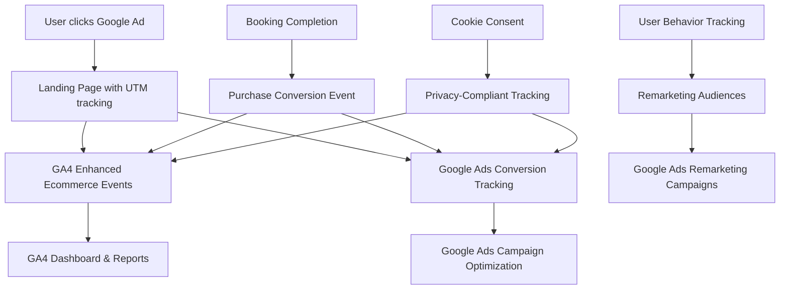

# Design Document

## Overview

This design implements a comprehensive Google Ads and Google Analytics 4 integration for the Tomodachi Tours customer booking platform. The solution builds upon the existing GA4 analytics service to add Google Ads conversion tracking, enhanced attribution, and remarketing capabilities. The integration will enable data-driven advertising optimization while maintaining GDPR compliance and user privacy.

## Architecture

### High-Level Architecture



### Data Flow Architecture

1. **Ad Click Attribution**: UTM parameters capture campaign source data
2. **Event Tracking**: Enhanced ecommerce events track user journey
3. **Conversion Attribution**: Multi-touch attribution connects ads to bookings
4. **Audience Building**: User behavior creates remarketing segments
5. **Privacy Compliance**: Consent management controls data collection

## Components and Interfaces

### 1. Google Ads Conversion Tracking Component

**Purpose**: Track conversions and send data to Google Ads for campaign optimization

**Key Functions**:
- Initialize Google Ads conversion tracking
- Fire conversion events with transaction data
- Handle offline conversion imports
- Manage conversion attribution windows

**Interface**:
```javascript
class GoogleAdsTracker {
  initializeConversionTracking(conversionId, conversionLabel)
  trackConversion(transactionData, conversionAction)
  trackOfflineConversion(gclid, conversionData)
  setConversionValue(value, currency)
}
```

### 2. Enhanced Attribution Service

**Purpose**: Manage multi-touch attribution and campaign source tracking

**Key Functions**:
- Parse and store UTM parameters
- Track user journey across sessions
- Attribute conversions to correct campaigns
- Handle cross-device attribution

**Interface**:
```javascript
class AttributionService {
  captureUTMParameters(url)
  storeAttributionData(sessionData)
  getAttributionChain(userId)
  attributeConversion(conversionData)
}
```#
## 3. Remarketing Audience Manager

**Purpose**: Create and manage remarketing audiences based on user behavior

**Key Functions**:
- Define audience segments based on tour interest
- Track booking funnel abandonment
- Create custom audiences for different tour types
- Manage audience exclusions for converted users

**Interface**:
```javascript
class RemarketingManager {
  createAudience(audienceConfig)
  addUserToAudience(userId, audienceId)
  removeUserFromAudience(userId, audienceId)
  getAudienceSegments()
}
```

### 4. Privacy Compliance Manager

**Purpose**: Ensure GDPR compliance and respect user privacy preferences

**Key Functions**:
- Manage cookie consent preferences
- Control tracking pixel firing
- Handle data deletion requests
- Anonymize tracking data

**Interface**:
```javascript
class PrivacyManager {
  checkConsentStatus()
  enableTracking(trackingTypes)
  disableTracking(trackingTypes)
  deleteUserData(userId)
}
```

### 5. Campaign Performance Dashboard

**Purpose**: Provide unified view of Google Ads and GA4 performance data

**Key Functions**:
- Display campaign ROI and ROAS metrics
- Show conversion attribution reports
- Track tour-specific performance
- Generate automated insights

**Interface**:
```javascript
class PerformanceDashboard {
  getCampaignMetrics(dateRange, campaigns)
  getConversionAttribution(conversionId)
  getTourPerformance(tourType)
  generateInsights(performanceData)
}
```

## Data Models

### Attribution Data Model
```javascript
{
  sessionId: string,
  userId: string,
  timestamp: Date,
  source: string,
  medium: string,
  campaign: string,
  term: string,
  content: string,
  gclid: string,
  fbclid: string,
  landingPage: string,
  referrer: string
}
```

### Conversion Event Model
```javascript
{
  conversionId: string,
  transactionId: string,
  userId: string,
  timestamp: Date,
  value: number,
  currency: string,
  tourType: string,
  tourId: string,
  quantity: number,
  attributionChain: AttributionData[],
  conversionAction: string
}
```

### Remarketing Audience Model
```javascript
{
  audienceId: string,
  name: string,
  description: string,
  criteria: {
    pageViews: string[],
    events: string[],
    timeWindow: number,
    exclusions: string[]
  },
  membershipDuration: number,
  isActive: boolean
}
```

## Error Handling

### Tracking Failures
- **Fallback Mechanisms**: Implement retry logic for failed tracking calls
- **Offline Tracking**: Queue events when network is unavailable
- **Error Logging**: Log tracking failures for debugging
- **Graceful Degradation**: Continue site functionality if tracking fails

### Privacy Compliance Errors
- **Consent Validation**: Verify consent before firing tracking pixels
- **Data Retention**: Automatically purge data based on retention policies
- **Opt-out Handling**: Immediately stop tracking when users opt out
- **Cross-border Compliance**: Handle different privacy regulations by region

### Attribution Challenges
- **Cross-device Tracking**: Use Google's cross-device reports where available
- **Attribution Windows**: Handle different attribution windows for different campaigns
- **Multi-touch Attribution**: Implement data-driven attribution models
- **Offline Conversions**: Handle phone bookings and offline attribution

## Testing Strategy

### Unit Testing
- Test individual tracking functions with mock data
- Validate UTM parameter parsing and storage
- Test privacy compliance logic
- Verify conversion event formatting

### Integration Testing
- Test GA4 and Google Ads pixel firing
- Validate end-to-end conversion tracking
- Test remarketing audience creation
- Verify cross-platform data consistency

### Performance Testing
- Measure tracking script load times
- Test impact on page performance
- Validate tracking under high traffic
- Monitor data processing delays

### Privacy Testing
- Test consent management workflows
- Validate data deletion processes
- Test tracking disabling functionality
- Verify GDPR compliance measures#
# Implementation Considerations

### Current System Integration
The design builds upon the existing analytics service (`customer/src/services/analytics.js`) which already implements:
- GA4 enhanced ecommerce tracking
- Tour-specific event tracking
- Purchase conversion events
- User engagement metrics

### Environment Configuration
New environment variables required:
- `REACT_APP_GOOGLE_ADS_CONVERSION_ID`: Google Ads account conversion ID
- `REACT_APP_GOOGLE_ADS_CONVERSION_LABELS`: JSON object mapping conversion actions to labels
- `REACT_APP_GTM_CONTAINER_ID`: Google Tag Manager container ID (optional)
- `REACT_APP_PRIVACY_POLICY_URL`: Link to privacy policy for consent management

### Third-party Dependencies
- Google Tag Manager (optional but recommended)
- Google Ads conversion tracking library
- Cookie consent management library (e.g., CookieBot, OneTrust)
- Cross-device tracking utilities

### Performance Optimization
- Lazy load tracking scripts to minimize initial page load impact
- Use Google Tag Manager for centralized tag management
- Implement client-side caching for attribution data
- Optimize tracking event batching to reduce network requests

### Security Considerations
- Validate all tracking data before sending to prevent injection attacks
- Use secure HTTPS connections for all tracking calls
- Implement rate limiting for tracking events to prevent abuse
- Sanitize UTM parameters and user input data

### Scalability Planning
- Design for high-traffic scenarios during peak booking seasons
- Implement efficient data storage for attribution chains
- Plan for multiple campaign types and tour offerings
- Consider server-side tracking for critical conversion events

### Monitoring and Alerting
- Set up alerts for tracking failures or data discrepancies
- Monitor conversion tracking accuracy and attribution quality
- Track performance impact of additional tracking scripts
- Implement dashboards for real-time campaign performance monitoring

## Migration Strategy

### Phase 1: Foundation Setup
1. Configure Google Ads account and conversion actions
2. Set up Google Tag Manager container
3. Implement basic conversion tracking
4. Test tracking accuracy with small campaigns

### Phase 2: Enhanced Attribution
1. Implement UTM parameter capture and storage
2. Build attribution chain tracking
3. Set up cross-device attribution
4. Create attribution reporting dashboard

### Phase 3: Remarketing and Optimization
1. Create remarketing audiences based on user behavior
2. Implement dynamic remarketing for tour-specific ads
3. Set up automated bidding optimization
4. Launch comprehensive remarketing campaigns

### Phase 4: Advanced Features
1. Implement offline conversion tracking
2. Add predictive audience modeling
3. Create automated campaign optimization rules
4. Integrate with customer lifetime value models