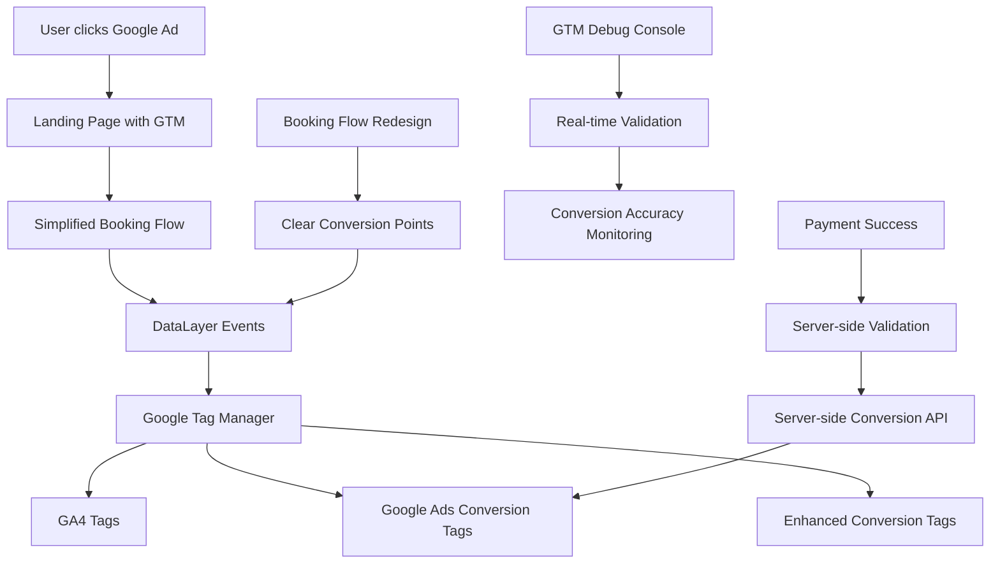

# Design Document

## Overview

This design implements a comprehensive solution to fix Google Ads conversion tracking issues by combining Google Tag Manager (GTM) implementation with a redesigned booking/payment flow. The solution addresses the root causes of conversion tracking failures: complex direct gtag integrations, missing conversion labels, unreliable attribution chains, and overly complex tracking architecture. By migrating to GTM and simplifying the booking flow, we'll create a robust, debuggable, and Google Ads-compliant conversion tracking system.

## Architecture

### High-Level Architecture



### Current vs. New Architecture Comparison

**Current Issues:**
- Direct gtag calls scattered throughout components
- Complex attribution service with potential failure points
- Missing/placeholder conversion labels
- Multiple tracking services creating conflicts
- Difficult to debug tracking failures

**New Architecture Benefits:**
- Centralized tag management through GTM
- Simplified dataLayer-based event system
- Clear conversion tracking points
- Built-in debugging and validation
- Server-side backup conversion tracking

## Components and Interfaces

### 1. Google Tag Manager Integration Layer

**Purpose**: Replace direct gtag calls with GTM-managed tags and provide centralized tag management

**Key Functions**:
- Initialize GTM container and dataLayer
- Push structured events to dataLayer
- Manage tag firing rules and triggers
- Provide debug and validation capabilities

**Interface**:
```javascript
class GTMService {
  initialize(containerId)
  pushEvent(eventName, eventData)
  setUserProperties(properties)
  enableDebugMode()
  validateTagFiring(tagName)
}
```

### 2. Simplified Booking Flow Manager

**Purpose**: Redesign booking flow with clear, reliable conversion tracking points

**Key Functions**:
- Manage booking state with clear progression steps
- Fire dataLayer events at optimal conversion points
- Handle payment provider integration cleanly
- Provide conversion validation and retry logic

**Interface**:
```javascript
class BookingFlowManager {
  initializeBooking(tourData)
  trackViewItem(itemData)
  trackBeginCheckout(checkoutData)
  trackAddPaymentInfo(paymentData)
  trackPurchase(transactionData)
  validateConversion(conversionId)
}
```

### 3. Enhanced Conversion Service

**Purpose**: Implement Google Ads enhanced conversions with customer data hashing

**Key Functions**:
- Hash customer email and phone data
- Prepare enhanced conversion payloads
- Handle privacy compliance for customer data
- Manage cross-device attribution

**Interface**:
```javascript
class EnhancedConversionService {
  hashCustomerData(customerInfo)
  prepareEnhancedConversion(conversionData, customerData)
  validatePrivacyCompliance(data)
  trackEnhancedConversion(enhancedData)
}
```

### 4. Server-side Conversion Backup

**Purpose**: Provide server-side conversion tracking as backup for client-side failures

**Key Functions**:
- Validate successful bookings server-side
- Fire conversion events via Google Ads API
- Handle offline conversion imports
- Provide conversion reconciliation

**Interface**:
```javascript
class ServerSideConversionService {
  validateBookingSuccess(bookingId)
  fireServerSideConversion(conversionData)
  importOfflineConversions(conversionList)
  reconcileConversions(dateRange)
}
```

### 5. Conversion Monitoring and Validation

**Purpose**: Monitor conversion tracking accuracy and provide real-time validation

**Key Functions**:
- Track conversion firing success rates
- Compare tracked vs. actual conversions
- Alert on tracking discrepancies
- Provide diagnostic information

**Interface**:
```javascript
class ConversionMonitor {
  trackConversionAttempt(conversionData)
  validateConversionFiring(conversionId)
  compareActualVsTracked(dateRange)
  generateDiagnosticReport()
}
```

## Data Models

### GTM DataLayer Event Model
```javascript
{
  event: string, // 'view_item', 'begin_checkout', 'purchase', etc.
  event_category: string,
  event_label: string,
  value: number,
  currency: string,
  transaction_id: string,
  items: [{
    item_id: string,
    item_name: string,
    item_category: string,
    price: number,
    quantity: number
  }],
  user_data: {
    email_hash: string,
    phone_hash: string
  },
  custom_parameters: {
    tour_id: string,
    tour_location: string,
    booking_date: string,
    payment_provider: string
  }
}
```

### Enhanced Conversion Data Model
```javascript
{
  conversion_action: string,
  conversion_value: number,
  currency: string,
  order_id: string,
  enhanced_conversion_data: {
    email: string, // hashed
    phone_number: string, // hashed
    first_name: string, // hashed
    last_name: string, // hashed
    street: string, // hashed
    city: string,
    region: string,
    postal_code: string,
    country: string
  },
  attribution_data: {
    gclid: string,
    wbraid: string,
    gbraid: string
  }
}
```

### Simplified Booking State Model
```javascript
{
  bookingId: string,
  currentStep: 'view_item' | 'begin_checkout' | 'add_payment_info' | 'purchase',
  tourData: {
    tourId: string,
    tourName: string,
    price: number,
    date: string,
    time: string
  },
  customerData: {
    email: string,
    phone: string,
    name: string
  },
  paymentData: {
    provider: string,
    amount: number,
    currency: string
  },
  conversionTracking: {
    viewItemTracked: boolean,
    beginCheckoutTracked: boolean,
    addPaymentInfoTracked: boolean,
    purchaseTracked: boolean
  }
}
```

## Error Handling

### GTM Loading Failures
- **Fallback Mechanism**: Implement direct gtag fallback if GTM fails to load
- **Timeout Handling**: Set 5-second timeout for GTM initialization
- **Error Logging**: Log GTM loading failures for debugging
- **User Experience**: Ensure booking flow continues even if tracking fails

### Conversion Tracking Failures
- **Retry Logic**: Implement exponential backoff retry for failed conversions
- **Server-side Backup**: Fire server-side conversion if client-side fails
- **Validation Checks**: Verify conversion firing before considering success
- **Alert System**: Alert administrators of conversion tracking failures

### Enhanced Conversion Issues
- **Data Validation**: Validate customer data before hashing
- **Privacy Compliance**: Ensure all PII is properly hashed
- **Fallback Tracking**: Fire standard conversions if enhanced conversions fail
- **Cross-device Handling**: Handle cases where enhanced data is unavailable

## Testing Strategy

### GTM Implementation Testing
- Test GTM container loading and initialization
- Validate dataLayer event structure and timing
- Test tag firing rules and triggers
- Verify GA4 and Google Ads tag configuration

### Booking Flow Testing
- Test each conversion point in the redesigned flow
- Validate event firing at correct timing
- Test payment provider integration
- Verify conversion data accuracy

### Enhanced Conversion Testing
- Test customer data hashing functionality
- Validate enhanced conversion payload structure
- Test privacy compliance measures
- Verify cross-device attribution

### Server-side Conversion Testing
- Test server-side conversion API integration
- Validate booking success detection
- Test offline conversion import
- Verify conversion reconciliation accuracy

## Implementation Considerations

### Migration Strategy

**Phase 1: GTM Setup and Basic Migration**
1. Set up GTM container with basic GA4 configuration
2. Implement dataLayer service to replace direct gtag calls
3. Migrate existing analytics events to GTM structure
4. Test parallel tracking to ensure no data loss

**Phase 2: Google Ads Conversion Setup**
1. Configure Google Ads conversion actions in GTM
2. Set up proper conversion labels and values
3. Implement enhanced conversions with customer data
4. Test conversion tracking accuracy

**Phase 3: Booking Flow Redesign**
1. Simplify booking flow conversion points
2. Implement clear state management
3. Add conversion validation and retry logic
4. Test end-to-end booking and tracking

**Phase 4: Server-side Backup Implementation**
1. Set up server-side conversion tracking
2. Implement booking validation logic
3. Add conversion reconciliation
4. Test backup conversion scenarios

### Environment Configuration

**New Environment Variables:**
```bash
# Google Tag Manager
REACT_APP_GTM_CONTAINER_ID=GTM-XXXXXXX
REACT_APP_GTM_AUTH=your_auth_token
REACT_APP_GTM_PREVIEW=your_preview_token

# Google Ads (actual values, not placeholders)
REACT_APP_GOOGLE_ADS_CONVERSION_ID=AW-17482092392
REACT_APP_GOOGLE_ADS_CONVERSION_LABELS={
  "purchase": "AbC-D_efGhIjKlMnOp",
  "begin_checkout": "XyZ-A_bcDeFgHiJkLm",
  "view_item": "QrS-T_uvWxYzAbCdEf"
}

# Enhanced Conversions
REACT_APP_ENHANCED_CONVERSIONS_ENABLED=true
REACT_APP_CUSTOMER_DATA_HASHING_SALT=your_secure_salt

# Server-side Conversion API
GOOGLE_ADS_DEVELOPER_TOKEN=your_developer_token
GOOGLE_ADS_CLIENT_ID=your_client_id
GOOGLE_ADS_CLIENT_SECRET=your_client_secret
GOOGLE_ADS_REFRESH_TOKEN=your_refresh_token
```

### Performance Optimization

**GTM Loading Optimization:**
- Load GTM asynchronously to prevent blocking
- Implement GTM loading timeout and fallback
- Use GTM's built-in performance monitoring
- Optimize tag firing rules to reduce overhead

**Booking Flow Optimization:**
- Minimize conversion tracking overhead
- Batch dataLayer events where possible
- Implement efficient state management
- Reduce unnecessary re-renders during tracking

### Security Considerations

**Customer Data Protection:**
- Hash all PII before sending to Google services
- Use secure hashing algorithms (SHA-256)
- Implement proper salt management
- Ensure GDPR compliance for enhanced conversions

**API Security:**
- Secure Google Ads API credentials
- Implement proper authentication for server-side conversions
- Use HTTPS for all tracking requests
- Validate all tracking data before processing

### Monitoring and Alerting

**Conversion Tracking Monitoring:**
- Real-time conversion firing validation
- Daily conversion accuracy reports
- Alert on conversion tracking failures
- Monitor conversion value accuracy

**GTM Performance Monitoring:**
- Track GTM loading success rates
- Monitor tag firing performance
- Alert on GTM container issues
- Track dataLayer event success rates

## Success Metrics

### Technical Success Metrics
- GTM container loads successfully 99%+ of the time
- Conversion tracking accuracy of 95%+ compared to actual bookings
- Zero Google Ads conversion setup warnings
- Server-side conversion backup fires within 30 seconds of booking success

### Business Success Metrics
- Google Ads campaigns can use automated bidding strategies
- Conversion data enables effective campaign optimization
- Attribution accuracy improves campaign ROAS measurement
- Reduced time spent debugging tracking issues

## Rollback Plan

### Emergency Rollback
If critical issues arise, the system can immediately rollback to:
1. Direct gtag implementation (current system)
2. Disable GTM and use fallback tracking
3. Revert booking flow changes
4. Maintain basic conversion tracking functionality

### Gradual Rollback
For less critical issues:
1. Disable specific GTM tags while keeping container
2. Revert individual booking flow components
3. Disable enhanced conversions while keeping standard tracking
4. Adjust conversion tracking points without full rollback