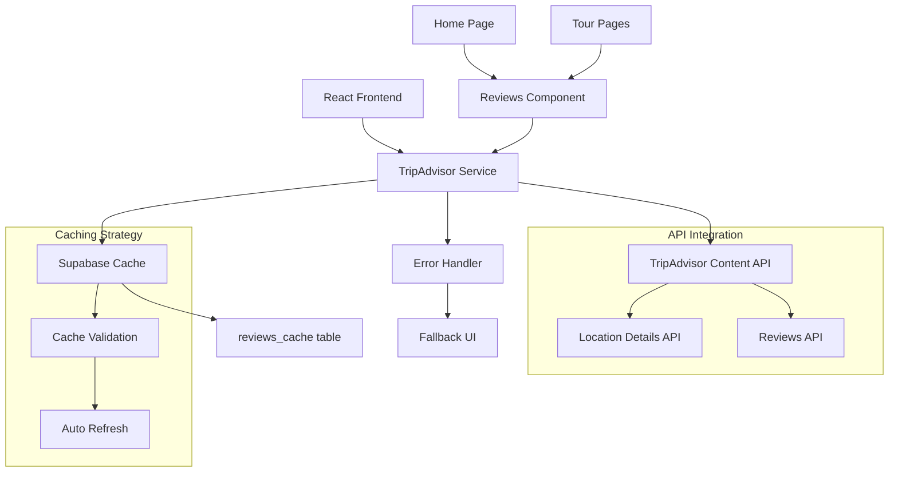

# Design Document

## Overview

The TripAdvisor Reviews Integration will add a customer reviews section to the Tomodachi Tours website by integrating with the TripAdvisor Content API. The feature will display authentic customer reviews in a visually appealing, responsive format that builds trust and helps potential customers make informed booking decisions.

**Key Design Principles:**
- Performance-first approach with intelligent caching
- Graceful degradation when API is unavailable
- Mobile-responsive design matching existing site aesthetics
- Compliance with TripAdvisor's branding and attribution requirements
- Seamless integration with existing React architecture

## Architecture

### System Architecture



### Data Flow

1. **Initial Load**: Component requests reviews from TripAdvisor service
2. **Cache Check**: Service checks Supabase cache for valid data
3. **API Call**: If cache miss/expired, fetch from TripAdvisor API
4. **Data Processing**: Transform API response to component format
5. **Cache Update**: Store processed data in Supabase with timestamp
6. **Component Render**: Display reviews with proper attribution

### Website URL for TripAdvisor API Registration

**Primary Domain**: `https://tomodachitours.com`
- This is the production domain that will make API requests
- Must be registered with TripAdvisor for API access
- All requests will originate from this domain

## Components and Interfaces

### 1. TripAdvisor Service (`tripAdvisorService.js`)

**Purpose**: Handle all TripAdvisor API interactions, caching, and error handling

**Key Methods:**
```javascript
// Fetch reviews for the business
async function fetchBusinessReviews(locationId, options = {})

// Get cached reviews or fetch fresh ones
async function getReviews(locationId, forceRefresh = false)

// Validate and refresh cache
async function refreshCache(locationId)

// Handle API errors gracefully
function handleApiError(error)
```

**Configuration:**
- API endpoint: `https://api.content.tripadvisor.com/api/v1/`
- Rate limiting: Respect TripAdvisor's rate limits
- Caching: 6-hour cache duration for reviews
- Error handling: Graceful fallback to cached data

### 2. Reviews Component (`TripAdvisorReviews.jsx`)

**Purpose**: Display TripAdvisor reviews in a responsive, accessible format

**Props Interface:**
```javascript
{
  locationId: string,           // TripAdvisor location ID
  maxReviews: number,          // Maximum reviews to display (default: 6)
  showRating: boolean,         // Show overall rating (default: true)
  layout: 'grid' | 'carousel', // Display layout (default: 'grid')
  className: string            // Additional CSS classes
}
```

**Features:**
- Responsive grid/carousel layout
- Review truncation with "read more"
- TripAdvisor branding and attribution
- Loading states and error handling
- Smooth animations and transitions

### 3. Review Card Component (`ReviewCard.jsx`)

**Purpose**: Individual review display component

**Props Interface:**
```javascript
{
  review: {
    id: string,
    title: string,
    text: string,
    rating: number,
    author: string,
    date: string,
    helpful_votes: number
  },
  truncateLength: number,      // Characters before truncation
  showDate: boolean,           // Show review date
  showHelpfulVotes: boolean    // Show helpful votes count
}
```

### 4. Cache Management

**Supabase Table Schema:**
```sql
CREATE TABLE tripadvisor_reviews_cache (
  id SERIAL PRIMARY KEY,
  location_id VARCHAR(50) NOT NULL,
  reviews_data JSONB NOT NULL,
  overall_rating DECIMAL(2,1),
  total_reviews INTEGER,
  cached_at TIMESTAMP WITH TIME ZONE DEFAULT NOW(),
  expires_at TIMESTAMP WITH TIME ZONE NOT NULL,
  UNIQUE(location_id)
);
```

## Data Models

### TripAdvisor API Response Model

```javascript
// Location Details Response
{
  location_id: "string",
  name: "string",
  rating: "4.5",
  num_reviews: "150",
  ranking_data: {
    ranking: "1",
    ranking_string: "#1 of 50 Tours in Kyoto"
  }
}

// Reviews Response
{
  data: [
    {
      id: "string",
      lang: "en",
      location_id: "string",
      published_date: "2024-01-15",
      rating: 5,
      helpful_votes: 2,
      title: "Amazing tour experience!",
      text: "Had a wonderful time exploring Kyoto...",
      user: {
        username: "TravelLover123",
        user_location: {
          name: "New York, NY"
        }
      }
    }
  ]
}
```

### Internal Data Model

```javascript
// Processed Review Object
{
  id: string,
  title: string,
  text: string,
  rating: number,           // 1-5 stars
  author: string,
  authorLocation: string,
  date: string,            // ISO date string
  helpfulVotes: number,
  isVerified: boolean
}

// Business Summary Object
{
  locationId: string,
  name: string,
  overallRating: number,
  totalReviews: number,
  ranking: string,
  tripAdvisorUrl: string
}
```

## Error Handling

### Error Scenarios and Responses

1. **API Rate Limit Exceeded**
   - Use cached data if available
   - Display message: "Reviews temporarily unavailable"
   - Retry after rate limit reset

2. **Network/API Failure**
   - Fallback to cached reviews
   - Show error state if no cache available
   - Log error for monitoring

3. **Invalid Location ID**
   - Log error and notify administrators
   - Hide reviews section gracefully
   - Don't break page layout

4. **Malformed API Response**
   - Validate response structure
   - Filter out invalid review objects
   - Display available valid reviews

### Error Logging

```javascript
// Error logging structure
{
  timestamp: Date,
  error_type: 'api_failure' | 'rate_limit' | 'validation_error',
  location_id: string,
  error_message: string,
  stack_trace: string,
  user_agent: string
}
```

## Testing Strategy

### Unit Tests

1. **TripAdvisor Service Tests**
   - API response parsing
   - Cache validation logic
   - Error handling scenarios
   - Rate limit handling

2. **Component Tests**
   - Review rendering with mock data
   - Responsive layout behavior
   - Loading and error states
   - User interactions (read more, etc.)

3. **Integration Tests**
   - End-to-end API integration
   - Cache invalidation workflows
   - Error recovery scenarios

### Test Data

```javascript
// Mock TripAdvisor API responses
const mockReviewsResponse = {
  data: [
    {
      id: "review_1",
      title: "Excellent tour guide!",
      text: "Our guide was knowledgeable and friendly...",
      rating: 5,
      published_date: "2024-01-15",
      user: {
        username: "JohnDoe",
        user_location: { name: "Tokyo, Japan" }
      },
      helpful_votes: 3
    }
  ]
};
```

### Performance Testing

- Load testing with multiple concurrent requests
- Cache performance validation
- Mobile responsiveness testing
- Accessibility compliance testing

## Implementation Phases

### Phase 1: Core Infrastructure
- Set up TripAdvisor API service
- Implement caching mechanism
- Create basic review component

### Phase 2: UI/UX Implementation
- Design responsive review cards
- Implement carousel/grid layouts
- Add loading and error states

### Phase 3: Integration & Polish
- Integrate with homepage and tour pages
- Add TripAdvisor branding compliance
- Implement analytics tracking

### Phase 4: Testing & Optimization
- Comprehensive testing suite
- Performance optimization
- Error handling refinement

## Security Considerations

1. **API Key Management**
   - Store TripAdvisor API key in environment variables
   - Never expose API key in client-side code
   - Use Supabase Edge Functions for secure API calls

2. **Data Validation**
   - Validate all API responses
   - Sanitize review text content
   - Prevent XSS attacks in review display

3. **Rate Limiting**
   - Implement client-side rate limiting
   - Cache aggressively to minimize API calls
   - Monitor API usage patterns

## Compliance Requirements

### TripAdvisor Branding Guidelines

1. **Attribution Requirements**
   - Display "Powered by TripAdvisor" logo
   - Include link to TripAdvisor listing
   - Use approved TripAdvisor brand colors

2. **Content Guidelines**
   - Display reviews as-is without modification
   - Include reviewer attribution
   - Show review dates and ratings

3. **Technical Requirements**
   - Only make requests from registered domain
   - Respect API rate limits
   - Cache data appropriately

## Monitoring and Analytics

### Key Metrics to Track

1. **API Performance**
   - Response times
   - Error rates
   - Cache hit ratios

2. **User Engagement**
   - Reviews section view rates
   - Click-through to TripAdvisor
   - Time spent reading reviews

3. **Business Impact**
   - Conversion rate correlation
   - User feedback on reviews
   - SEO impact measurement