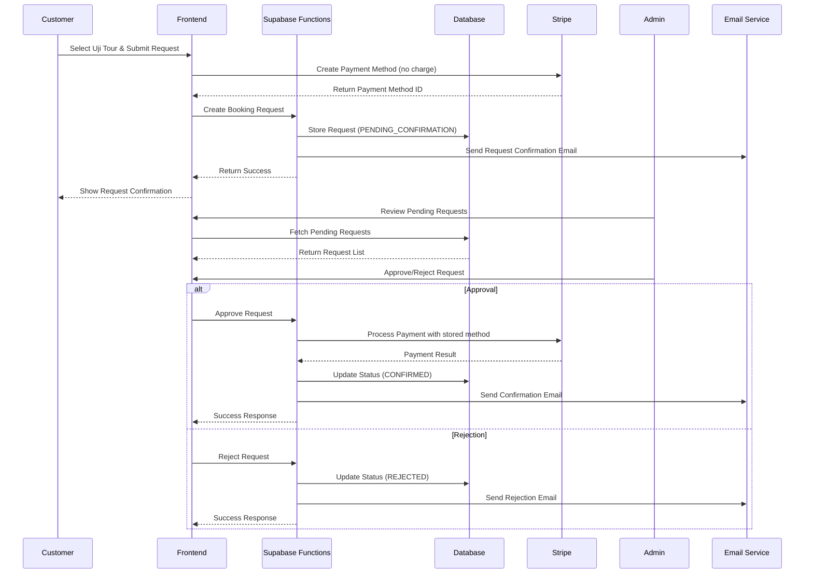

# Design Document

## Overview

The Uji tour booking request system introduces a manual approval workflow specifically for Uji tours (both "uji-tour" and "uji-walking-tour" tour types), while maintaining the existing instant confirmation flow for all other tours. The system captures customer booking requests, stores payment method information securely, enables admin approval/rejection, and processes deferred payments upon approval.

## Architecture

### High-Level Flow



### System Components

1. **Frontend Modifications**: Conditional checkout flow based on tour type
2. **Database Schema**: New booking statuses and request tracking
3. **Payment Processing**: Deferred payment with stored payment methods
4. **Admin Interface**: Request management dashboard
5. **Email System**: Request and status notification emails
6. **Background Processing**: Automated cleanup and monitoring

## Components and Interfaces

### Frontend Components

#### Modified Checkout Flow
- **Location**: `customer/src/Components/Checkout/`
- **Purpose**: Detect Uji tours and switch to request flow
- **Key Changes**:
  - Tour type detection logic
  - Conditional UI rendering (Request vs. Pay button)
  - Payment method creation without immediate charge
  - Request confirmation messaging

#### New BookingRequestForm Component
- **Location**: `customer/src/Components/Checkout/BookingRequestForm.tsx`
- **Purpose**: Handle booking request submission
- **Features**:
  - Form validation
  - Payment method setup
  - Request submission
  - Success/error handling

#### Admin Request Management
- **Location**: `admin/src/pages/booking-requests/`
- **Purpose**: Admin interface for managing requests
- **Features**:
  - Pending requests list
  - Request details view
  - Approve/reject actions
  - Status tracking

### Backend Services

#### Booking Request Service
- **Location**: `supabase/functions/create-booking-request/`
- **Purpose**: Handle booking request creation
- **Responsibilities**:
  - Validate request data
  - Store payment method securely
  - Create booking record with PENDING_CONFIRMATION status
  - Send confirmation emails
  - Log request events

#### Request Management Service
- **Location**: `supabase/functions/manage-booking-request/`
- **Purpose**: Handle approval/rejection
- **Responsibilities**:
  - Validate admin permissions
  - Process payment on approval
  - Update booking status
  - Send status notification emails
  - Handle payment failures gracefully

### Database Schema Extensions

#### Booking Status Updates
```sql
-- Add new booking statuses
ALTER TYPE booking_status ADD VALUE 'PENDING_CONFIRMATION';
ALTER TYPE booking_status ADD VALUE 'REJECTED';

-- Add request-specific fields
ALTER TABLE bookings ADD COLUMN IF NOT EXISTS 
    payment_method_id TEXT,
    request_submitted_at TIMESTAMP WITH TIME ZONE,
    admin_reviewed_at TIMESTAMP WITH TIME ZONE,
    admin_reviewed_by TEXT,
    rejection_reason TEXT;
```

#### Request Tracking Table
```sql
CREATE TABLE booking_request_events (
    id SERIAL PRIMARY KEY,
    booking_id INTEGER REFERENCES bookings(id),
    event_type TEXT NOT NULL, -- 'submitted', 'approved', 'rejected', 'payment_failed'
    event_data JSONB,
    created_at TIMESTAMP WITH TIME ZONE DEFAULT NOW(),
    created_by TEXT
);
```

## Data Models

### Enhanced Booking Model
```typescript
interface BookingRequest extends Booking {
    status: 'PENDING_CONFIRMATION' | 'CONFIRMED' | 'REJECTED' | 'CANCELLED';
    payment_method_id?: string; // Stripe Payment Method ID
    request_submitted_at?: string;
    admin_reviewed_at?: string;
    admin_reviewed_by?: string;
    rejection_reason?: string;
}
```

### Request Event Model
```typescript
interface BookingRequestEvent {
    id: number;
    booking_id: number;
    event_type: 'submitted' | 'approved' | 'rejected' | 'payment_failed';
    event_data: {
        admin_id?: string;
        rejection_reason?: string;
        payment_error?: string;
        amount?: number;
    };
    created_at: string;
    created_by: string;
}
```

### Admin Request View Model
```typescript
interface AdminBookingRequest {
    id: number;
    customer_name: string;
    customer_email: string;
    customer_phone?: string;
    tour_type: string;
    tour_name: string;
    booking_date: string;
    booking_time: string;
    adults: number;
    children: number;
    infants: number;
    total_amount: number;
    discount_applied?: {
        code: string;
        amount: number;
    };
    request_submitted_at: string;
    status: string;
    payment_method_id: string;
}
```

## Error Handling

### Payment Processing Errors
- **Scenario**: Payment fails after admin approval
- **Handling**:
  1. Log payment failure with details
  2. Keep booking in PENDING_CONFIRMATION status
  3. Notify admin of payment failure
  4. Send customer email explaining issue
  5. Allow admin to retry payment or reject request

### Admin Action Errors
- **Scenario**: Admin approval/rejection fails
- **Handling**:
  1. Show error message to admin
  2. Log error details
  3. Keep request in original status
  4. Allow retry of action
  5. Escalate to system admin if persistent

### Email Delivery Failures
- **Scenario**: Confirmation/notification emails fail
- **Handling**:
  1. Log email failure in email_failures table
  2. Continue with booking process
  3. Queue for manual follow-up
  4. Provide admin notification of email issues

### Timeout Handling
- **Scenario**: Requests not processed within 24 hours
- **Handling**:
  1. Automated reminder emails to admins
  2. Customer notification of delay
  3. Optional auto-rejection after 48 hours
  4. Cleanup of expired payment methods

## Testing Strategy

### Unit Tests
- **Payment Method Creation**: Test Stripe payment method setup without charging
- **Request Validation**: Test booking request data validation
- **Status Transitions**: Test valid status changes and restrictions
- **Email Templates**: Test email content generation and personalization

### Integration Tests
- **End-to-End Request Flow**: Customer request → Admin approval → Payment processing
- **Payment Failure Recovery**: Test payment failure handling and retry mechanisms
- **Email Delivery**: Test email sending for all scenarios
- **Admin Interface**: Test admin actions and UI updates

### Load Testing
- **Concurrent Requests**: Test multiple simultaneous booking requests
- **Admin Dashboard**: Test performance with many pending requests
- **Payment Processing**: Test payment processing under load

### Security Testing
- **Payment Method Security**: Ensure payment methods are stored securely
- **Admin Authorization**: Test admin-only access to request management
- **Data Validation**: Test input sanitization and validation
- **Rate Limiting**: Test protection against abuse

## Implementation Considerations

### Tour Type Detection
The system will identify Uji tours by checking the `tourId` parameter:
- `uji-tour` → Booking request flow
- `uji-walking-tour` → Booking request flow  
- All other tours → Existing instant confirmation flow

### Payment Method Storage
- Use Stripe's Payment Methods API to store customer payment information
- Payment methods are created but not charged immediately
- Secure storage with automatic cleanup of unused methods
- PCI compliance maintained through Stripe's secure vault

### Admin Workflow Integration
- Integrate with existing admin dashboard structure
- Use existing authentication and authorization
- Maintain consistent UI/UX patterns
- Add new navigation items for request management

### Backward Compatibility
- No changes to existing tour booking flows
- Existing database schema remains compatible
- Current admin interfaces unaffected
- Email templates extend existing system

### Performance Optimization
- Index new database fields for query performance
- Implement pagination for admin request lists
- Cache frequently accessed tour configuration data
- Optimize email template rendering

### Monitoring and Analytics
- Track request-to-booking conversion rates
- Monitor payment failure rates and reasons
- Alert on pending requests exceeding time limits
- Dashboard metrics for admin efficiency